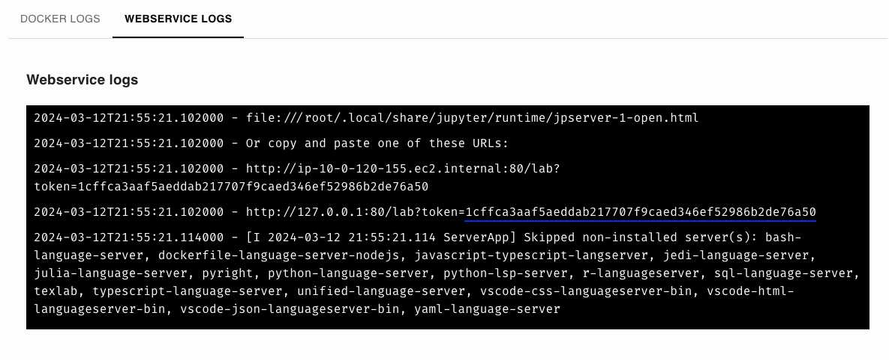
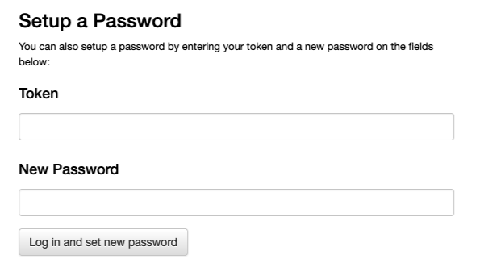

# JupyterLab


```{important}
If you're on a free account, always back up your work because your app can be terminated if inactive. If you need JupyterLab deployed with production settings, contact us [contact@ploomber.io](mailto:contact.ploomber.io)
```

You can deploy JupyterLab to Ploomber Cloud and use it as a development environment.

To do so, download the files from the
[example](https://github.com/ploomber/doc/tree/main/examples/docker/jupyterlab), create a `.zip` file and deploy it using the Docker option:


Once the deployment finishes, go to `WEBSERVICE LOGS` and copy the token:



Then, open the application by clicking on `VIEW APPLICATION`:


Then, scroll down, paste the token, and set a password (write it down!):



And you're ready to use JupyterLab!

## Real-time collaboration

Collaboration is configured by default! Share your `id.ploomberapp.io` URL with a colleague, the password, and open the same notebook, you'll get Google Doc-like collaboration!


