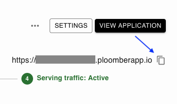

# MLflow

```{important}
If you're on a free account, always back up your work because your app can be terminated if inactive. If you need MLflow deployed with production settings, contact us [contact@ploomber.io](mailto:contact.ploomber.io)
```

`````{tab-set}

````{tab-item} Web
__Deploy from the menu__

To deploy MLflow, create an [account](https://platform.ploomber.io/register?utm_source=mlflow&utm_medium=documentation).

Then, download the Dockerfile from the
[example](https://github.com/ploomber/doc/tree/main/examples/docker/mlflow), create a `.zip` file and deploy it using the Docker option:


````{tab-item} Command-line

To download and deploy MLflow start by installing Ploomber Cloud and setting your API key:

```sh
pip install ploomber-cloud
ploomber-cloud key YOUR-KEY
```

```{tip}
If you don't have an API key yet, follow the [instructions here.](../quickstart/apikey.md)
```

Now, download the MLflow example. It will prompt you for a location to download the app. To download in the current directory, just press enter.

```sh
ploomber-cloud examples docker/mlflow
```

You should see a confirmation with instructions on deploying your app. Now, navigate to your application:

```sh
cd location-you-entered/mlflow/
```

__Deploy from the CLI__

Initialize and deploy your app with:

```sh
ploomber-cloud init
ploomber-cloud deploy --watch
```

````

`````


Once the deployment finishes, open the app by clicking on `VIEW APPLICATION`, if all
went well you'll be prompted for a user and a password:

- User: admin
- Password: password

## Changing the default password


For safety, let's change the credentials. Install the `requests` package:

```sh
pip install requests
```

And run the following in a Python session:

```python
import requests
from getpass import getpass

host = input("Enter your {id}.ploomberapp.io URL: ")
password_new = getpass("Enter new password:")

response = requests.patch(
    f"{host}/api/2.0/mlflow/users/update-password",
    auth=("admin", "password"),
    json={"username": "admin", "password": password_new},
)

response.raise_for_status()

print("Your new password is:", password_new)
```

You'll be prompted for your MLflow host (e.g., `something.ploomberapp.io`), you can
get this from the Ploomber UI:



Then, enter the new password.

To confirm that the password was changed, open the MLflow dashboard again and enter the new password.


## Tracking experiments

To start tracking experiments, install mlflow locally:

```sh
pip install mlflow
```

Set your credentials as environment variables:

```sh
export MLFLOW_TRACKING_USERNAME=admin
export MLFLOW_TRACKING_PASSWORD=yourpassword
```

And run the following (replace the `set_tracking_uri` call with your host!):

```python
import mlflow
mlflow.set_tracking_uri(uri="https://someid.ploomberapp.io")

mlflow.set_experiment("first-experiment")

with mlflow.start_run():
    mlflow.log_params({"a": 21, "b": 21})
    mlflow.log_metric("accuracy", 0.91)
```

If all goes well, you'll see:

```
2024/03/12 19:44:39 INFO mlflow.tracking.fluent: Experiment with name 'first-experiment' does not exist. Creating a new experiment.
```

And the experiment will be visible from MLflow's dashboard.