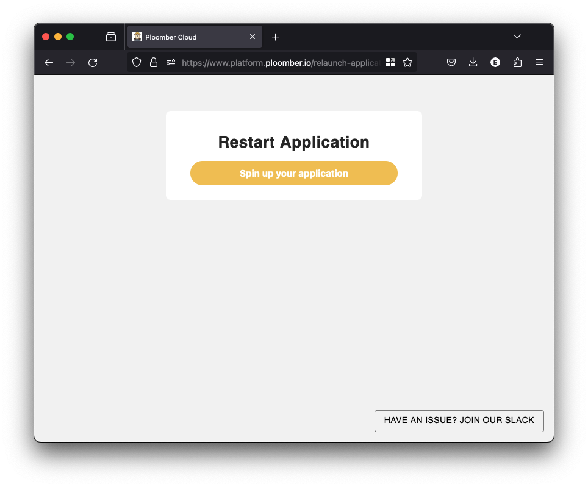
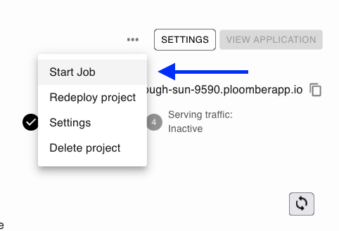

# FAQ

## Installing PyTorch

If you're deploying Docker apps using a free account, your build might fail if it takes too many resources. To fix it, you can install the CPU-only version of PyTorch. Add the following to your `Dockerfile` *before* any packages that have PyTorch as a dependency

```Dockerfile
# install the cpu-only torch (or any other torch-related packages)
# you might modify it to install another version
RUN pip install torch==2.1.1 torchvision==0.16.1 --index-url https://download.pytorch.org/whl/cpu

# any packages that depend on pytorch must be installed after the previous RUN command
```

## Installing OpenCV

If you're using OpenCV and your application gets stuck during deployment, ensure you check the `Webservice logs`, if you're using a base image that doesn't have all dependencies required by OpenCV, you might run into issues like this one:

> libGL.so.1: cannot open shared object file

If that's the case, run the following before installing OpenCV, note that this requires your base image to use `apt` as its package manager. We recommend you using the `python:3.11` base image.

```Dockerfile
RUN apt-get update && apt-get install ffmpeg libsm6 libxext6  -y
```

## Installing geopandas/fiona/GDAL

If you want to deploy an application that uses `geopandas`, you can simply add it
to your `requirements.txt` file:

```
geopandas
```

This will work as long as you're deploying any of the officially supported frameworks
or if you're using the Docker deployment option and using the `python:3.11` base image.
Here's a sample [Voilà app](https://github.com/ploomber/doc/tree/main/examples/voila/geopandas).

`geopandas` can be tricky to install because it depends on `fiona`, which depends
on GDAL, fortunately, `fiona` [bundles GDAL](https://fiona.readthedocs.io/en/stable/README.html#installation)
which simplifies installation, this allows `geopandas` to work by adding it to the `requirements.txt` file.

The caveat of this method is that the bundled GDAL is not fully-featured and omits
many GDAL's optional drivers. If you require a full-fledged GDAL version on your
application, you can do it by using the Docker deployment option and installing
GDAL in your Docker image. [Here's a sample app.](https://github.com/ploomber/doc/tree/main/examples/voila/gdal)

(pin-dependencies)=
## Pinning dependencies

When deploying an app, you need to add your dependencies in a `requirements.txt` file,
here's an example:

```
pandas
numpy
matplotlib
```

However, this `requirements.txt` might break your app during a re-deployment if any of
the packages changes their API. To prevent that, you can
pin your dependencies once your app is running locally.

Rename `requirements.txt` to `requirements.unpinned.txt`, and
then generate a new `requirements.txt` with:

```sh
pip freeze > requirements.txt
```

This will produce a new `requirements.txt` file with specific versions
for each package, ensuring that upgrades to the dependencies don't break your app.

## Displaying Chinese characters

If you're using matplotlib and want to display Chinese characters in your plots,
you might encounter issues. Most likely, you're missing a font that allows you
to display the characters. Check out this
[example](https://github.com/ploomber/doc/tree/main/examples/docker/matplotlib-chinese),
to test it, deploy it using the [Docker option.](../apps/docker.md)


(stopping-apps)=
## Stopping applications

If you're a community user (or a Pro user with >3 apps) you apps will be stopped if
they don't receive traffic.

When this happens, your app will show a screen like this:



When clicking on `Spin up your application` your app will restart and be available
in ~1 minute.

You can also start your application from the dashboard:




```{note}
If you see an error after restarting, wait for a few seconds. If the issue still
persists, contact us at [contact@ploomber.io](mailto:contact@ploomber.io)
```

(customize-deployment)=
## Customize deployment

You may want to deploy your application using [Docker](../apps/docker.md) for customizing the process. 
Here's a few additional features that `Docker` deployment allows:

* Installing packages that are not available via pip, e.g., `Shiny R`.
* Downloading specific modules, e.g., `Spacy` models.
* Changing the Python version.
* Customizing the Docker base image.
* Adding a cache layer

To unlock `Docker` deployment, [upgrade to Pro.](https://ploomber.io/pricing/)

[Click here](../pricing/overview.md) to see all Pro, Teams, and Enterprise features.