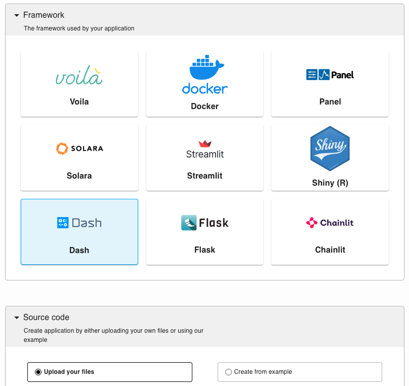

# Comprehensive Guide to Dash UI Customization

Explore various methods to customize your Dash app UI, from using styling with CSS and Dash Bootstrap Components, to building custom Dash components to achieve advanced customization using React.

1. Inline CSS Styling
2. Using Your Own CSS Files
3. Dash Bootstrap Components 
4. Custom Callbacks for Dynamic Styling
5. Building Custom Dash Components

Each section includes simple scripts that feature a title and a button, demonstrating how these methods can be practically applied to enhance your application's aesthetics and functionality.

## Methods for UI Customization in Dash
### 1. Inline CSS Styling
#### Example Code
- `app1.py`

### 2. Using Your Own CSS Files
#### Example Code
- `app2.py`
- `assets/style.css`

### 3. Dash Bootstrap Components
#### Prerequisites
- Run `pip install dash-bootstrap-components`
#### Example Code
- `app3.py`

### 4. Custom Callbacks for Dynamic Styling
#### Prerequisites
- Run `pip install dash-bootstrap-components` (note: `dash-bootstrap-components` is not required to implement custom callback functions, but it is used in `app4.py` as it is implemented on top of `app3.py`.)
#### Example Code
- `app4.py`


### 5. Building Custom Dash Components
#### Step-by-Step
- Download and install Node.js and npm from the [Node.js official website](https://nodejs.org/en)
- Run `pip install cookiecutter`
- Run `pip install virtualenv`
- Run `cookiecutter gh:plotly/dash-component-boilerplate`
- Navigate into the newly created `<project_shortname>` directory and update `usage.py` for your Dash app and `src/lib/components/<component_name>.react.js` for your custom component
- `npm run build` to compile
- Run `python usage.py` and check out your Dash app

Note: To learn more about the `dash-component-boilerplate`, refer to [here](https://github.com/plotly/dash-component-boilerplate).

#### Example Code for Custom Button Component and Deployment on Ploomber Cloud
- `app5/app.py`: Main script for the Dash app (can replace the `usage.py` file)
- `app5/CustomButton.react.js`: Main source code for the custom component (can replace the `src/lib/components/<component_name>.react.js` file)
- `app5/requirements.txt`: For deployment on Ploomber Cloud
- `app5/demo/`: The generated Python scripts required for deployment on Ploomber Cloud


## Deployment on Ploomber Cloud

To deploy your Dash app on Ploomber Cloud, you need:

- `app.py`
- `requirements.txt`

You should ensure your Dash app script is called `app.py`. Rename the one you want to deploy to `app.py`. Also, your `requirements.txt` should be:

```sh
dash
dash-bootstrap-components
```

Note: If you're deploying the last example that includes a custom component, ensure you also include the auto-generated scripts required for proper functionality:
- `<project_shortname>/__init__.py`
- `<project_shortname>/_imports_.py`
- `<project_shortname>/<component_name>.py`
- `<project_shortname>/<project_shortname>.min.js`
- `<project_shortname>/<project_shortname>.min.js.map`
- `<project_shortname>/package-info.json`

### Graphical User Interface (GUI)

Log into your [Ploomber Cloud account](https://www.platform.ploomber.io/applications).

Click the NEW button to start the deployment process:


Select the Dash option, and upload your code as a zip file in the source code section:



After optionally customizing some settings, click `CREATE`.

### Command Line Interface (CLI)

If you haven't installed `ploomber-cloud`, run:
```sh
pip install ploomber-cloud
```

Set your API key following [this documentation](https://docs.cloud.ploomber.io/en/latest/quickstart/apikey.html).
```sh
ploomber-cloud key YOURKEY
```

Navigate to your project directory where your files are located:
```sh
cd <project-name>
```

Then, initialize the project and confirm the inferred project type (Dash) when prompted:
```sh
(testing_dash_app) ➜ ploomber-cloud init                    ✭ ✱
Initializing new project...
Inferred project type: 'dash'
Is this correct? [y/N]: y
Your app '<id>' has been configured successfully!
To configure resources for this project, run 'ploomber-cloud resources' or to deploy with default configurations, run 'ploomber-cloud deploy'
```

Deploy your application and monitor the deployment at the provided URL:

```sh
(testing_dash_app) ➜  cloud ploomber-cloud deploy                  ✭ ✱
Compressing app...
Adding app.py...
Ignoring file: ploomber-cloud.json
Adding requirements.txt...
App compressed successfully!
Deploying project with id: <id>...
The deployment process started! Track its status at: https://www.platform.ploomber.io/applications/<id>/<job_id>
```

For more details, refer to this [documentation](https://docs.cloud.ploomber.io/en/latest/user-guide/cli.html).
