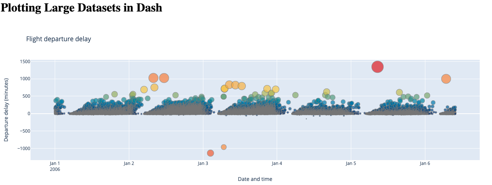
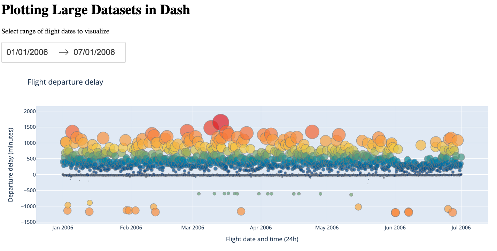
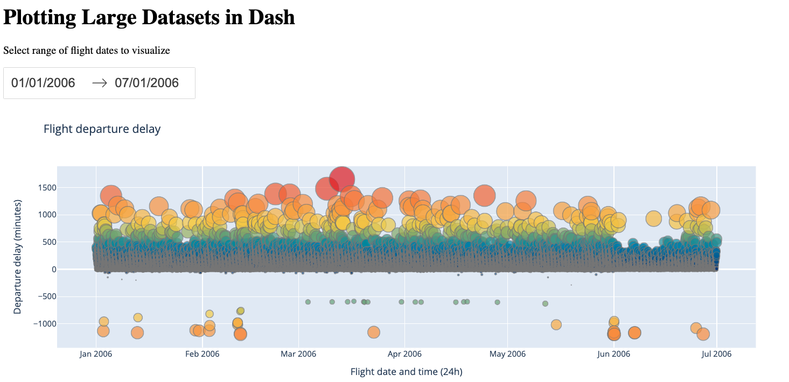

# Plotting large datasets in Dash

Interactive Dash application that plots large datasets using:
- [**WebGL**](https://plotly.com/python/webgl-vs-svg/) (in `webgl` folder): a powerful technology that uses GPU to accelerate computation, helping you render figures more effectively. This method is generally ideal for figures with up to 100,000-200,000 markers (terminology for data points in charts), depending on the power of your GPU. For figures larger than that, it's often optimal to aggregate the data points first

- [**`plotly-resampler`**](https://github.com/predict-idlab/plotly-resampler) (in `resampler` folder): an external library that dynamically aggregates time-series data respective to the current graph view. This approach helps you downsample your dataset at the cost of losing some details.

- Combining the above approaches (in `combined` folder).

We will be using a commercial flight dataset that documents information such as flight departure date/time and delays. You can find it [here](https://github.com/vega/falcon/blob/master/data/flights-3m.csv).

Once you download the dataset, run `python csv-clean.py flights-3m.csv` to obtained the cleaned csv file `flights-3m-cleaned.csv`. Move the cleaned file to the `data` folder in the project folder (`webgl`, `resample` or  `combined`). 

## Local testing

`cd` into the folder of the approach you want to test, then run `gunicorn app:server run --bind 0.0.0.0:80`. You should be able to access the app at `0.0.0.0:80`.

## Upload to Ploomber Cloud

Ensure that you are in the correct project folder.

### Command line

Go to your app folder and set your API key: `ploomber-cloud key YOURKEY`. Next, initialize your app: `ploomber-cloud init` and deploy it: `ploomber-cloud deploy`. For more details, please refer to our [documentation](https://docs.cloud.ploomber.io/en/latest/user-guide/cli.html).

### UI

Zip `app.py` together with `requirements.txt` and `data` folder, then upload to Ploomber Cloud. For more details, please refer to our [Dash deployment guide](https://docs.cloud.ploomber.io/en/latest/apps/dash.html).
