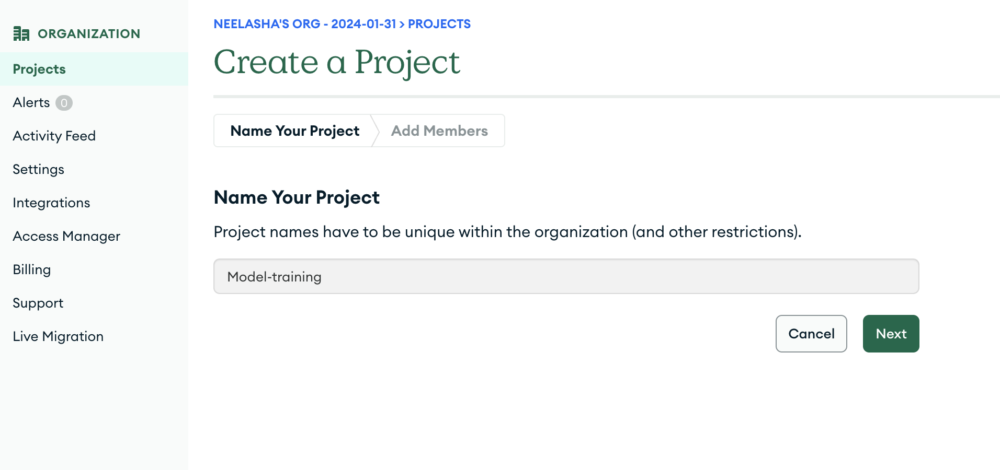
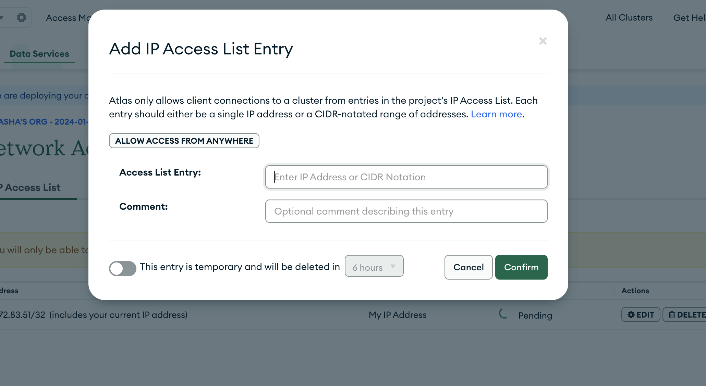
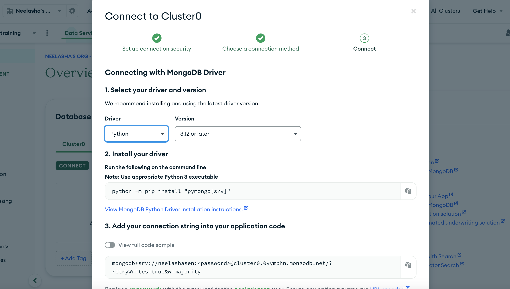
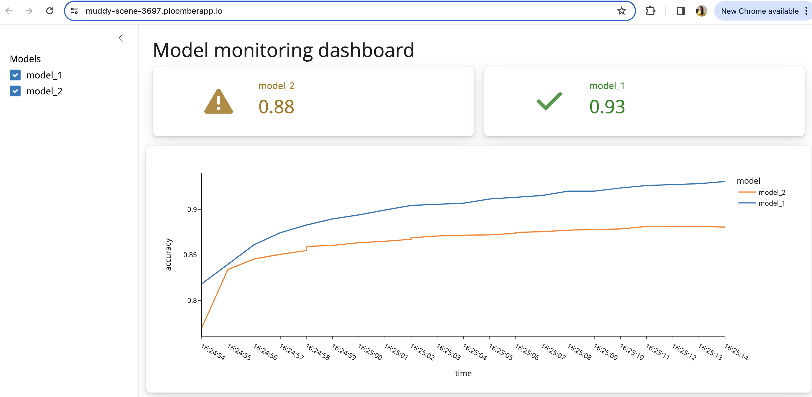
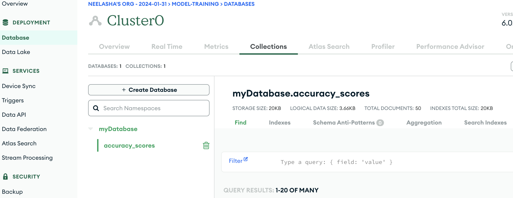

# Model monitoring application

This app is built on Shiny and allows you to visualize model training accuracy scores in realtime in 2 steps:

* Train multiple models with different parameters locally, and store the accuracy scores to a remote database at the end of every epoch.
* The visualisation application dynamically detects changes in the remote database and generates a plot as the training progresses.

## Connecting to MongoDB Cloud

For the purpose of this tutorial we will use the `MongoDB Atlas` cloud database. It allows users to host a database for free.
Let's see the steps for creating a cluster:

First create an account on [MongoDB cloud](https://www.mongodb.com/atlas/database) and create a new project:



Then select `Create deployment` and select the free tier `M0` or your desired tier. 

In the `Security Quickstart` page, select your authentication type. For this tutorial we have generated a username and password.

Select the `Cloud Environment` and open the `Network Access Page` in a new tab.


Now select `ALLOW ACCESS FROM ANYWHERE` and confirm to allow all IP addresses to connect to the cluster.



Once you have completed the access rules setup, select the `CONNECT` button on the `Overview` page to get the connection details. Specifically, copy the connection URI and set it in an environment variable `MONGODB_CONNECTION_URI`:

```bash
export MONGODB_CONNECTION_URI="connection_uri"
```



## Deploy application

Create a zip file using `Dockerfile`, `app.py` and `requirements.txt` and deploy this file to Ploomber cloud.
Refer to the [Shiny deployment documentation](https://docs.cloud.ploomber.io/en/latest/apps/shiny.html) for more details.

Note that you also need to set the MongoDB connection URI as an environment variable:


Once the `VIEW APPLICATION` button is enabled, you can start the training script and monitor the training.

## Train models

We will use the [MNIST dataset](https://www.tensorflow.org/datasets/catalog/mnist) and train two different models on the data. The models differ in the number of units in the `Dense` layer.
The training scripts write the accuracy values at the end of every epoch to the MongoDB database in a collection called `accuracy_scores`.

First create a virtual environment and install the required packages:

```bash
pip install tensorflow scikit-learn "pymongo[srv]"
```

To train two models parallely, open two terminals and run the below commands in each respectively:

```bash
python train.py --model model_1 --units 128
```

```bash
python train.py --model model_2 --units 12
```

In case you wish to change the model names you need to update the same in `app.py`.

Once the scripts are running you can monitor the accuracy scores as the training progresses on the Ploomber Cloud application deployed in above step:



Currently, the threshold for an accurate model (marked in green) is 0.9. You can modify it by setting `THRESHOLD_MID` in `app.py`.

If you wish to restart the training process you may drop the collection to ensure a clean plot:



