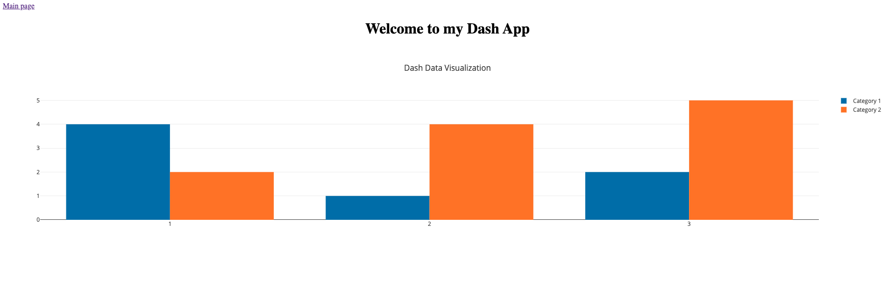
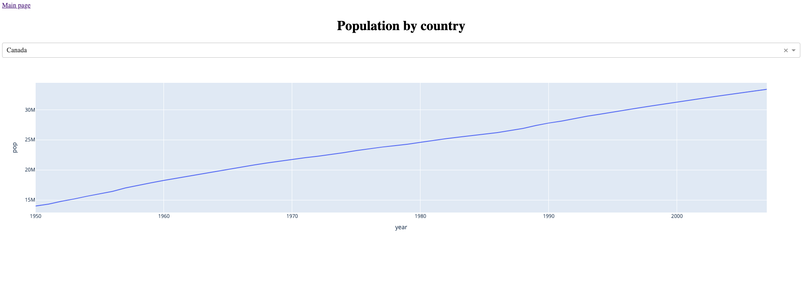

# Integrating Dash apps into a Flask app

Interactive Flask application, with Dash applications integrated using:
- Direct hosting: A simple approach more fitting for smaller projects is passing the Flask instance directly into each Dash app. However, since each of these app is a component of the main Flask app, adding too many Dash app components may overload the Flask server. See `host/app.py` for implementation. For more information, see the [Dash documentation](https://dash.plotly.com/reference#dash.dash).
- Middleware: Using middleware decouples each Dash app from the Flask app and each other, meaning they will be considered independent apps. This allows better horizontal scaling if we need to add a large amount of Dash apps, but resource sharing between apps may take extra steps compared to using app context. See `middleware/app.py` for implementation. For more information, see the [Flask documentation](https://flask.palletsprojects.com/en/2.3.x/patterns/appdispatch/).


||
|:--:| 
| *Main page* |

||
|:--:| 
| *Dash App 1 (Simple App)* |

||
|:--:| 
|*Dash App 2 (Population App)*|

## Local testing

Depending on which version you want to run, `cd middleware` or `cd host`, then run `gunicorn app:app run --bind 0.0.0.0:80`. You should be able to access the app at `0.0.0.0:80`.

## Upload to Ploomber Cloud

Ensure that you are in the correct project folder.

### Command line

Go to your app folder and set your API key: `ploomber-cloud key YOURKEY`. Next, initialize your app: `ploomber-cloud init` and deploy it: `ploomber-cloud deploy`. For more details, please refer to our [documentation](https://docs.cloud.ploomber.io/en/latest/user-guide/cli.html).

### UI

Zip `app.py` together with `requirements.txt` and `dash_apps` folder, then upload to Ploomber Cloud. For more details, please refer to our [Flask deployment guide](https://docs.cloud.ploomber.io/en/latest/apps/flask.html).

## Adding your own Dash app

To test using your own Dash app, ensure that your dash app (e.g. `dash.py`) is in the `dash_app` folder. Make sure to format `dash.py` as below:
```python
from dash import Dash, html, dcc, callback, Output, Input
import plotly.express as px
import pandas as pd
from flask import g # If you want to use Flask context global value

def init_app(url_path):
    # If initializing Dash app using Flask app as host
    # You will also need to assign g.cur_app to your host Flask server 
    # in your app.py
    app = Dash(server=g.cur_app, routes_pathname_prefix=url_path)
    
    # End if

    # If initializing Dash app for middleware
    app = Dash(requests_pathname_prefix=url_path)

    # End if

    # You can also store any data in g in app.py and access them here if using app_context
    var = g.your_data

    app.title = "Your Dash App"

    app.layout = html.Div("Write your Dash app layout here.")

    init_callbacks(app)
    return app.server


def your_update_func(input):
    pass

def init_callbacks(app):
    app.callback(
        Output("your-output-id", "output"), 
        Input("your-input-id", "input")
    )(your_update_func)
```

Next, in `app.py`, import your app and add it to `DASH_APPS_`. 
```python
from dash_apps import dash

DASH_APPS_ = {
    ...,
    '/your_app_url': (dash.init_app, "Your app name")
}
```

Re-run the Flask application, and you will see your app's URL added to the HTML display.
