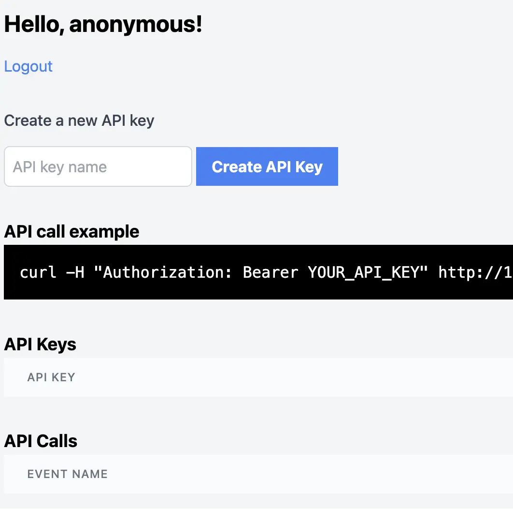

# Flask with authentication

Sample Flask application that allows creating accounts, signing in, and making requests via an API key.



This application requires a `FLASK_SECRET_KEY` variable, generate one with:

```sh
python -c 'import secrets; print(secrets.token_hex())'
```

Then, set the value:

```sh
export FLASK_SECRET_KEY=MYFLASKSECRETKEY
```

## Deployment

1. Create the database models by running `python models.py`
2. [Create an account in Ploomber Cloud](https://platform.ploomber.io/register)
3. [Follow this](https://docs.cloud.ploomber.io/en/latest/apps/flask.html)

Remember to add the `FLASK_SECRET_KEY` environment variable.

## Running locally

Start locally:

```sh
# create database models
python models.py

# start app
flask --app app run --debug
```

Building locally (with docker):

```sh
docker build . -t flask-login
docker run -p 5000:80 flask-login -e "FLASK_SECRET_KEY=$FLASK_SECRET_KEY" 
```

Then, open: http://0.0.0.0:5000/