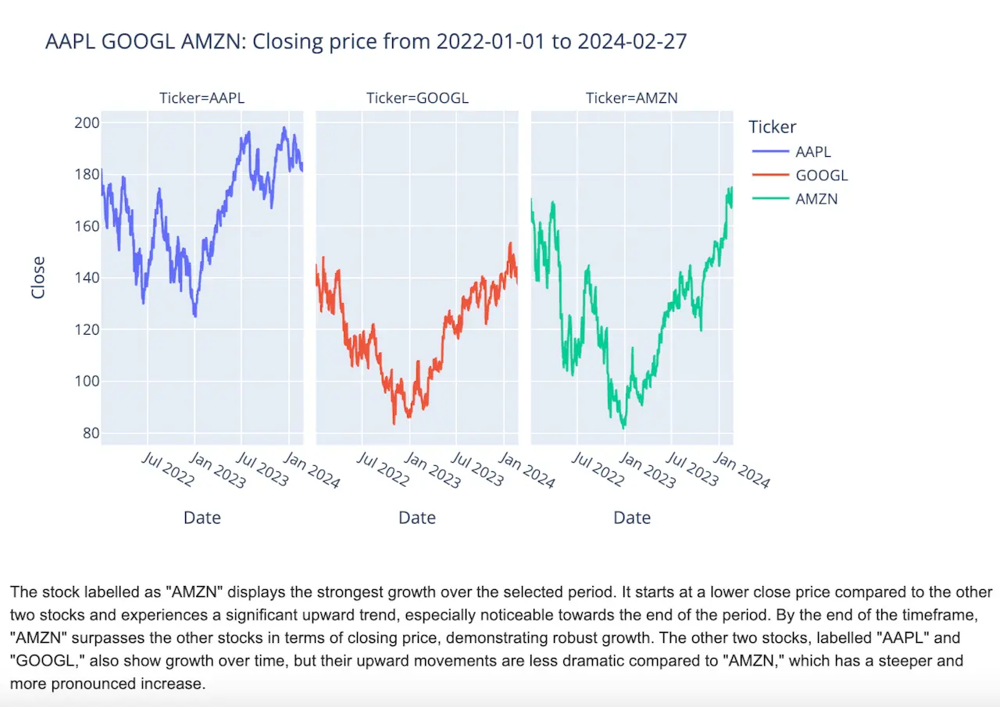

## LLM-powered Stock Market app with Panel

This application downloads stock market data from Yahoo Finance, populates a duckdb instance, generates a time series plot of the selected stocks. It also allows the user to ask a natural language question about the plot and get a response using the LLM model.



The app is built using Python Yahoo Finance [yfinance](https://pypi.org/project/yfinance/), [Panel](https://panel.holoviz.org/),[DuckDB](https://duckdb.org/), OpenAI's [Vision Model preview API](https://platform.openai.com/docs/guides/vision) and [ImageKit](https://docs.imagekit.io/getting-started/quickstart-guides/python/python_app). The app can be hosted on [Ploomber Cloud](https://www.platform.ploomber.io/).

The app will store the plot generated and save it to ImageKit.io, and then use the OpenAI API to generate a response to the user's question about the plot. 

### Pre-requisites

1. OpenAI API key. Visit their [Documentation](https://platform.openai.com/docs/api-reference/introduction)
2. ImageKit.io url endpoint, public key, and private key. Visit their [Dashboard](https://imagekit.io/dashboard)

Save your OpenAI API key in an environment variable. You can set it as an environment variable from the terminal as follows:

```bash
export OPENAI_API_KEY=your_api_key
export image_private_key=your-imagekit-private-key
export image_public_key=your-imagekit-public-key
export image_url_endpoint=your-imagekit-endpoint
```

To run the app, you need to install the following packages:

```bash
pip install -r requirements.txt
```

Download the tickers. You can use the `nasdaq_symbols.csv` in this repository. This file was obtained from [the NASDAQ site](https://www.nasdaq.com/market-activity/stocks/screener) - press download. 

If you want to use different tickers, ensure to replace the `nasdaq_symbols.csv` file with your file and update the `get_stock_symbols` function in the `stock.py` file.

```python
def get_stock_symbols():
# Symbols obtained from 
# https://www.nasdaq.com/market-activity/stocks/screener
    data = pd.read_csv("nasdaq_symbols.csv")
    symbols = data["Symbol"].to_list()
    names = data['Name'].to_list()

    symbol_name = {symbol: name for symbol, name in zip(symbols, names)}

    return symbols, symbol_name
```

### Running the app

```bash
panel serve app.py --autoreload --show
```

### Deploying the app to Ploomber Cloud

To deploy the app to Ploomber Cloud, you need to have a Ploomber Cloud account. Visit their [website](https://www.platform.ploomber.io/) to create an account. Once you have an account, you can deploy the Panel app to Ploomber Cloud using the following guides:

[Deploy Panel apps through the UI](https://docs.cloud.ploomber.io/en/latest/apps/panel.html).
[Add your secret variables](https://docs.cloud.ploomber.io/en/latest/user-guide/env-vars.html)